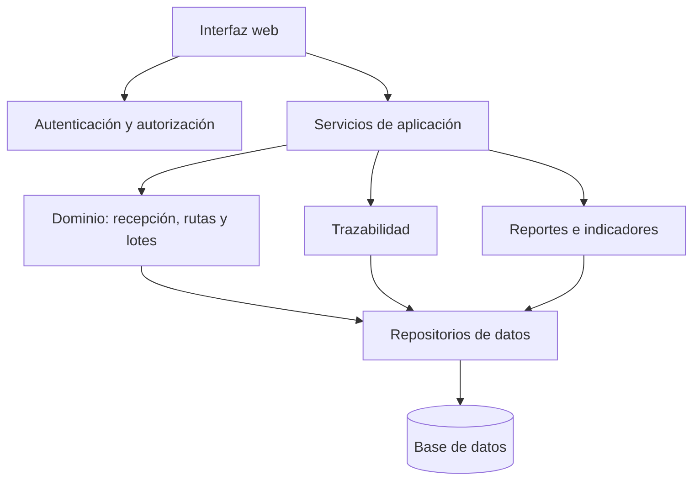
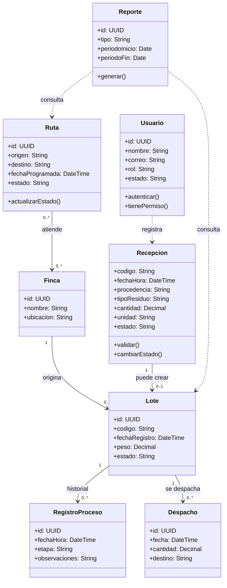

# Diagramas UML — Finca Catalina

Estos modelos son conceptuales. Deben contrastarse con el alcance aprobado y con la implementación real antes de considerarlos definitivos.

## 1. Diagrama de componentes

**Descripción:** la interfaz solicita operaciones a los servicios de aplicación; el dominio contiene las reglas del negocio; los repositorios separan la lógica de negocio del acceso a datos. La autorización debe comprobarse en el servidor.

## 2. Diagrama de clases conceptual

## 3. Patrones de diseño propuestos

- **State:** el estado de una recepción o lote cambia mediante transiciones válidas definidas por el dominio. Para recepción: Recibida → En revisión → Aceptada o Rechazada.
- **Observer:** cuando cambia el estado de un lote, componentes como trazabilidad, tablero o notificaciones podrían recibir un evento y actualizarse sin acoplarse directamente a la entidad.

## 4. Decisiones de diseño
- Los identificadores se generan de forma única.
- Las cantidades usan un tipo decimal y una unidad explícita.
- Las fechas se validan y normalizan.
- Los permisos se verifican en el servidor.
- Los diagramas describen una propuesta y no prueban que los módulos ya estén implementados.
